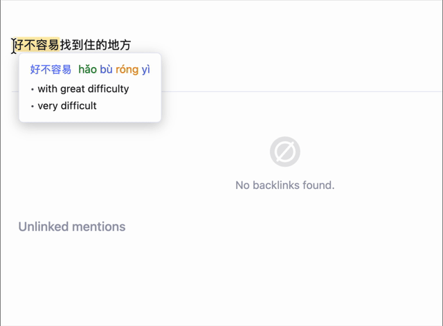

# Obsidian Hanzi

Offline Chinese-English dictionary lookup for [Obsidian](https://obsidian.md). Hover over any Chinese character to see its Traditional/Simplified forms, pinyin, and English definitions.

Powered by [CC-CEDICT](https://cc-cedict.org/wiki/) with 115,000+ entries. The dictionary is automatically downloaded on first use and cached locally for fully offline lookups.



## Features

- **Instant popup**: hover over any Chinese character in your notes to see definitions
- **Longest-match lookup**: automatically finds multi-character words (configurable up to 12 characters)
- **Traditional & Simplified**: displays both character forms with pinyin and all matching definitions
- **Tone-colored pinyin** with optional color-coding by tone (Pleco color scheme)
- **Offline lookup** (after first use): the dictionary is downloaded once on first load and cached locally, no network needed after that
- **Theme-aware**: inherits your Obsidian theme's colors and fonts

## Usage

**Desktop (hover mode):** Move your cursor over any Chinese character to see its definition in a popup.

**Desktop (selection mode):** Select Chinese text to trigger the popup.

**Mobile:** Selection mode is always used.

Switch between modes using the command palette:
- `Hanzi: Use hover mode`
- `Hanzi: Use selection mode`

## Settings

| Setting | Description | Default |
|---------|-------------|---------|
| Trigger mode | Hover or Manual Selection | Hover |
| Show Traditional | Display traditional character form | On |
| Show Simplified | Display simplified character form | On |
| Show Pinyin | Display pinyin pronunciation | On |
| Show Definitions | Display English definitions | On |
| Tone-colored pinyin | Color pinyin by tone | On |
| Popup font size | Size of popup text (8–32px) | 12px |
| Max look-ahead | Characters to scan for word match (1–12) | 8 |

## Network use

On first launch, the plugin downloads the CC-CEDICT dictionary file (~4 MB) from the plugin's [GitHub Releases](https://github.com/luongdn/obsidian-hanzi/releases) page using Obsidian's built-in `requestUrl` API. The file is cached locally in the plugin's `assets/` directory. After this one-time download, all lookups are fully offline - no further network requests are made.

## Installation

### From Obsidian Community Plugins

1. Open **Settings → Community plugins → Browse**
2. Search for **Hanzi**
3. Click **Install**, then **Enable**

### Manual Installation

1. Download `obsidian-hanzi-<version>.zip` from the [Releases](https://github.com/luongdn/obsidian-hanzi/releases) page
2. Extract the zip into your vault's `.obsidian/plugins/` directory (this creates the `obsidian-hanzi/` folder with all required files)
3. Reload Obsidian and enable the plugin in **Settings → Community plugins**

## Building from Source

```bash
npm install
npm run build
```

Copy `main.js`, `manifest.json`, `styles.css`, and `assets/` to your vault's plugin directory.

## AI Disclosure

This plugin was developed with the assistance of AI tools (Claude by Anthropic). AI was used for code generation, architecture design, and documentation throughout the development process. All AI-generated code was reviewed and tested before inclusion.
